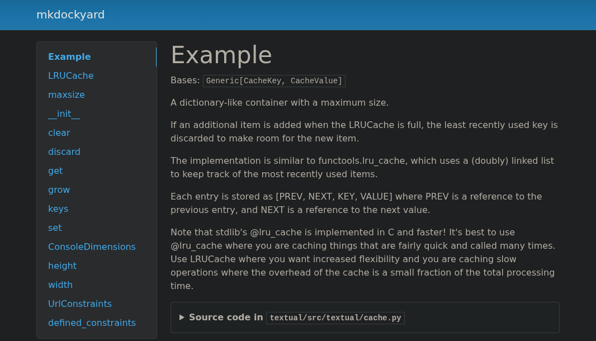

# Mkdockyard

A simple mkdocs + mkdocstring plugin that allows you to use docs from multiple
different repos. Simply specify a repo configuration, and your repos are ready
to dock 🚢

## Installation

```bash
uv add mkdockyard
```

**Requirements:** Requires git, [mkdocs](https://www.mkdocs.org/) and
[mkdocstrings](https://mkdocstrings.github.io/) to be installed and configured.

> [!IMPORTANT]
> `mkdockyard` must be listed **before** `mkdocstrings` in your `plugins`
> configuration, as it needs to set up repository paths before mkdocstrings
> processes them.

## Features

- **Lean & parallel cloning** - Only fetches the specified ref, and fetches
  multiple repos concurrently for faster builds
- **Reproducibility** - Supports and encourages the use of commit hashes to pin
  specific repo versions
- **Caching** - Repos are cached in your OS cache directory (e.g.
  `~/.cache/mkdockyard` on Linux) and reused between builds
- **Auto-pruning** - Automatically removes unused cached repos when the cache
  grows too large

## Example

```yml
# mkdocs.yml

site_name: mkdockyard

plugins:
  - mkdockyard:
      repos:
        - name: textual
          url: "https://github.com/Textualize/textual.git"
          ref: "501372027f3abc75561881e3803efc34098dabe1"
        - name: rich
          url: "https://github.com/Textualize/rich.git"
          ref: "1d402e0c59f8765e420a5a4440eb2fca7465d1ae"
        - name: pydantic
          url: "https://github.com/pydantic/pydantic.git"
          ref: "08b64f7a43f96f02bb0af8d46aba67b3a68d6e88"
  - mkdocstrings:
```

```md
<!-- A .md file in your docs -->

# Example

<!-- Schema: `::: [name-in-mkdockyard-repos-config].path.to.your.module` -->

::: textual.src.textual.cache.LRUCache

::: rich.rich.console.ConsoleDimensions

::: pydantic.pydantic.networks.UrlConstraints
```



## Limitations

- **Language support** - `mkdockyard` currently only supports the Python parser.
  Making this language agnostic _seems_ quite simple, so full language support
  may come in the v0.2 release.

## FAQ

### Why does `mkdockyard` notably increase my build times, even when repos are cached?

Including and referencing modules from other repos inherently increases the
strain on `mkdocstrings`. Large repos with deeply nested references may require
[griffe](https://github.com/mkdocstrings/griffe?tab=readme-ov-file) (the
mkdocstrings parser) to recurse 10s, 100s or even 1000s of times depending on
the number of docstring references in your documentation. Do this across
multiple repos and you end up with slow build times.

This is unlikely to be a `mkdockyard` problem, as `mkdockyard` only takes
milliseconds to build when using cached repos (though performance suggestions /
improvements are always welcome).

### Wh am I getting "Could not collect" errors when trying to document a cloned repo?

This could be for a variety of reasons, such as not using the correct naming
scheme, misspelling a path, etc.

One dubious edge case to be aware of is: if you have a package installed in your
environment (e.g., `mkdockyard` itself) and you're also trying to clone and
document a repo with the same `name` in your config, you'll encounter name
collision issues.

You can solve this by either:

1. Removing the repo from your config, and documenting the package directly.
   `mkdocstrings` directly supports documenting packages installed in your
   environment. **(Recommended)**

2. If you _really need_ the package in your `repos` configuration, change the
   name such that it doesn't conflict with the name of any installed packages.
   For example, to clone and document `mkdockyard` when you also have
   `mkdockyard` installed, you could do:

```yml
plugins:
  - mkdockyard:
      repos:
        - name: mkdockyard_repo # Changed from 'mkdockyard' to avoid collision
          url: "https://github.com/kay-mw/mkdockyard.git"
          ref: "main"
```

Then reference it as `::: mkdockyard_repo.path.to.some.module`.
